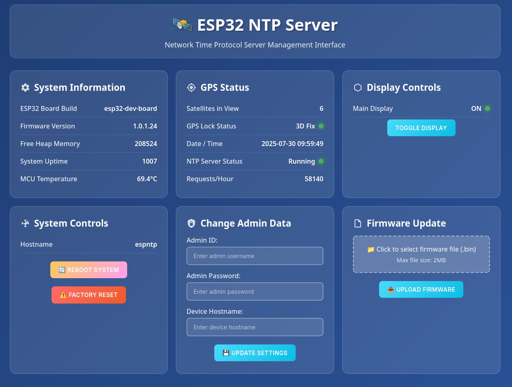

# ESP32 NTP Time Server



## Table of Contents
- [Introduction](#introduction)
- [Usage Guidelines and Liability](#usage-guidelines-and-liability)
- [Why Do This?](#why-do-this)
- [Features](#features)
- [Requirements](#requirements)
  - [Recommended Hardware](#recommended-hardware)
  - [Sample Hardware](#sample-hardware)
- [Getting Started](#getting-started)
  - [Build the Board](#build-the-board)
  - [Compile and Upload Code](#compile-and-upload-code)
- [Usage](#usage)
- [Warnings](#warnings)
- [License](#license)

## Introduction
This project creates an NTP (Network Time Protocol) server using various ESP32 chipsets, with feedback displayed on screens like SSD1306, ST7789, or Cheap Yellow Display.

The NTP server enables local devices to retrieve date and time without relying on an internet-based NTP server. An ATGM336H GPS module provides time data from GPS satellites, using a PPS (Pulse Per Second) signal for millisecond accuracy.

The system reports as a Stratum 10 server upon initial satellite sync and upgrades to Stratum 2 once a PPS lock is achieved. Due to Wi-Fi connectivity, it’s not a true Stratum 1 server but typically achieves accuracy in the low milliseconds.

## Usage Guidelines and Liability
This project is designed for hobbyists and developers to experiment with ESP32, GPS, and OLED display technologies.  It is not intended for use in critical applications (e.g., medical, aviation, or automotive systems) without professional validation.

- **Safety**: Ensure proper assembly to avoid electrical hazards, such as short circuits or overheating.
- **Regulatory Compliance**: The ESP32’s Wi-Fi and Bluetooth features may require certification (e.g., FCC, CE) if used in a commercial product. Users are responsible for verifying compliance.
- **Privacy**: GPS functionality must comply with local privacy laws. Do not use this project to track individuals without their consent.
- **No Liability**: The project creators are not responsible for any consequences arising from the use of this project, including hardware failures, legal violations, or damages.

## Why Do This project?
Using a local NTP server reduces outbound internet traffic by eliminating the need for devices to query external time servers like `pool.ntp.org`. This also mitigates risks from unauthorized scans targeting systems that contact public NTP pools, as noted in [this SANS diary entry](https://isc.sans.edu/diary/20681).

## Features
- Connects ESP32 to Wi-Fi
- Retrieves current time from a GPS module
- Synchronizes time across devices via NTP protocol
- Displays time on a connected screen
- Includes a web interface for configuration, monitoring, and flashing
- Supports the [ntpclient](https://github.com/joelinux/ntpclient) command-line tool to read time and view device stats

## Requirements
- A supported ESP32 chip
- VS Code with PlatformIO for code compilation
- Wi-Fi credentials
- Ability to receive GPS satellite signals (may not work indoors)

### Recommended Hardware
- [Teyleten Robot ATGM336H GPS+BDS Dual-Mode Module](https://www.amazon.com/dp/B09LQDG1HY)
- [ELEGOO 3PCS 0.96 Inch OLED](https://www.amazon.com/dp/B0D2RMQQHR)
- [ESP-WROOM-32 ESP32 ESP-32S Development Board](https://www.amazon.com/dp/B08D5ZD528)

### Sample Hardware
Tested hardware includes:
- [Teyleten Robot ATGM336H GPS+BDS Dual-Mode Module](https://www.amazon.com/dp/B09LQDG1HY)
- [OLED I2C IIC Display Module 12864](https://www.amazon.com/dp/B09C5K91H7)
- [D1 Mini ESP32 ESP-WROOM-32](https://www.amazon.com/dp/B0D8Y6B9C5)

## Getting Started

### [Build the Board](Build.md)

### Compile and Upload Code
1. Clone the repository:
   ```bash
   git clone https://github.com/joelinux/esp32NTP.git
   ```
2. Open the project in VS Code.
3. Compile the code using PlatformIO.
4. Upload to your ESP32 board.

## Usage
On first boot, the ESP32 enters Access Point mode for Wi-Fi configuration:
1. Connect to the `NTPS1` network (password: `12345678`).
2. Open a browser and navigate to `http://192.168.5.1`.
3. Enter your Wi-Fi SSID, password, and set an admin password.
4. The ESP32 will reboot and connect to your Wi-Fi if credentials are correct.

If credentials are incorrect, reset the device using the Reset PIN (varies by chip; see documentation for details).

Once connected, the ESP32 synchronizes time with GPS satellites if a signal is available. The display shows status information. If only "Starting System" appears, no satellite signal is detected. Use the USB serial port for debug information.

## Warnings
**Careful about board placement**
Since there are multiple board used is this project, care must be taken so electric components do not touch other boards.

**Avoid shorts with the GPS antenna**: The antenna wire can cause a short if it touches the board’s battery, leading to overheating. Secure the wire with hot glue to prevent contact.


## License
This project is licensed under the GNU General Public License v2. See the [LICENSE](LICENSE) file for details.